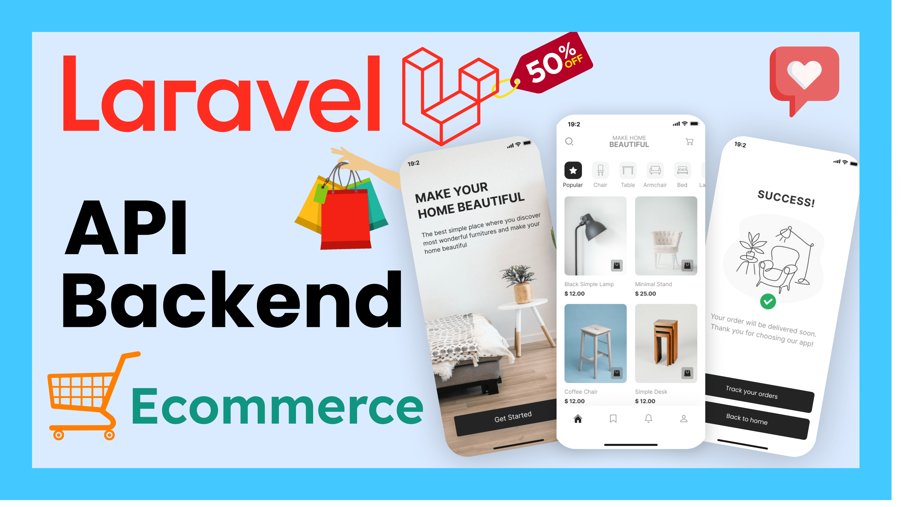

# Ecommerce Backend API Course


Welcome to the **Ecommerce Backend API Course** repository – a comprehensive 25-hour course dedicated to building robust and scalable backend APIs using Laravel. This documentation and the code exemplify professional best practices suitable for mid-level PHP and Laravel development.


---

## Table of Contents
- [Course Overview](#course-overview)
- [Key Features](#key-features)
- [Technologies Used](#technologies-used)
- [UI Design](#ui-design)
- [Resources](#resources)
- [Installation & Setup](#installation--setup)
- [Demo](#demo)
- [Support](#support)
- [License](#license)
- [Author](#author)

---

## Course Overview
This project serves as both a learning tool and a portfolio showcase. It covers end-to-end backend development using Laravel, including topics such as:
- RESTful API design
- Authentication & Authorization
- Database migrations and the Eloquent ORM
- Comprehensive testing and documentation
- Deployment best practices

---

## Key Features
- **Robust API Design:** Implements RESTful endpoints with clear separation of concerns.
- **Secure Authentication:** Built-in mechanisms for secure user authentication and authorization.
- **Database Management:** Uses migrations and Laravel’s Eloquent ORM for streamlined database interactions.
- **Comprehensive Testing:** Includes a full Postman collection for API testing and documentation.
- **Scalable Architecture:** Follows industry-standard practices for building production-ready applications.

---

## Technologies Used
- **PHP:** Version 8.x
- **Laravel:** A powerful PHP framework for web applications
- **MySQL/PostgreSQL:** Database management systems
- **Postman:** For API testing and documentation
- **Figma:** Used for frontend design (see UI Design section)

---

## UI Design
While this course primarily focuses on backend development, the frontend design has been meticulously crafted using Figma.  
- **Figma Design:** [View the Figma project](https://www.figma.com/file/8TvM4UJfGOE334pySsOqZp)


Additionally, UI images are included in the repository to showcase the intended look and feel of the final application.

---

## Resources
Enhance your learning experience with the following resources:
- **GitHub Repository:** [Ecommerce Backend API Course](https://github.com/sukhrobnurali/ecommerce-backend)
- **YouTube Playlist:** [Course Videos](https://www.youtube.com/playlist?list=PLlvUmyq_t3vw9WMsVGtiMSXRw2N1Etg5w)
- **Postman Documentation:** [API Documentation/Collection](https://documenter.getpostman.com/view/11570945/2sAYX9kfH2)
- **Support Telegram Group:** [Join the Group](https://t.me/dasturchilar_hamjamiyati)

---

## Installation & Setup
To set up this project locally, follow these steps:

1. **Clone the Repository**
   ```bash
   git clone https://github.com/sukhrobnurali/ecommerce-backend.git
   cd ecommerce-backend
   ```

2. **Install Dependencies**
   Ensure you have [Composer](https://getcomposer.org/) installed, then run:
   ```bash
   composer install
   ```

3. **Environment Configuration**
   Copy the example environment file and adjust your settings:
   ```bash
   cp .env.example .env
   ```
   Edit the `.env` file to include your database credentials and other configuration details.

4. **Generate Application Key**
   ```bash
   php artisan key:generate
   ```

5. **Run Migrations**
   ```bash
   php artisan migrate
   ```

6. **Start the Development Server**
   ```bash
   php artisan serve
   ```
   Access the application at `http://localhost:8000`.

---

## Demo
For a live demonstration of the API endpoints, refer to the [Postman Collection](https://documenter.getpostman.com/view/11570945/2sAYX9kfH2).

---

## Support
For questions, issues, or further discussions, please join our [Support Telegram Group](https://t.me/dasturchilar_hamjamiyati) or check out the detailed explanations in the [YouTube Playlist](https://www.youtube.com/playlist?list=PLlvUmyq_t3vw9WMsVGtiMSXRw2N1Etg5w).

---

## License
This project is licensed under the [MIT License](LICENSE).

---

## Author
Developed by [Sukhrob Nurali](https://github.com/sukhrobnurali).  
Feel free to explore my other projects and contributions on my GitHub profile.

---

Contributions, suggestions, or constructive feedback are always welcome.
